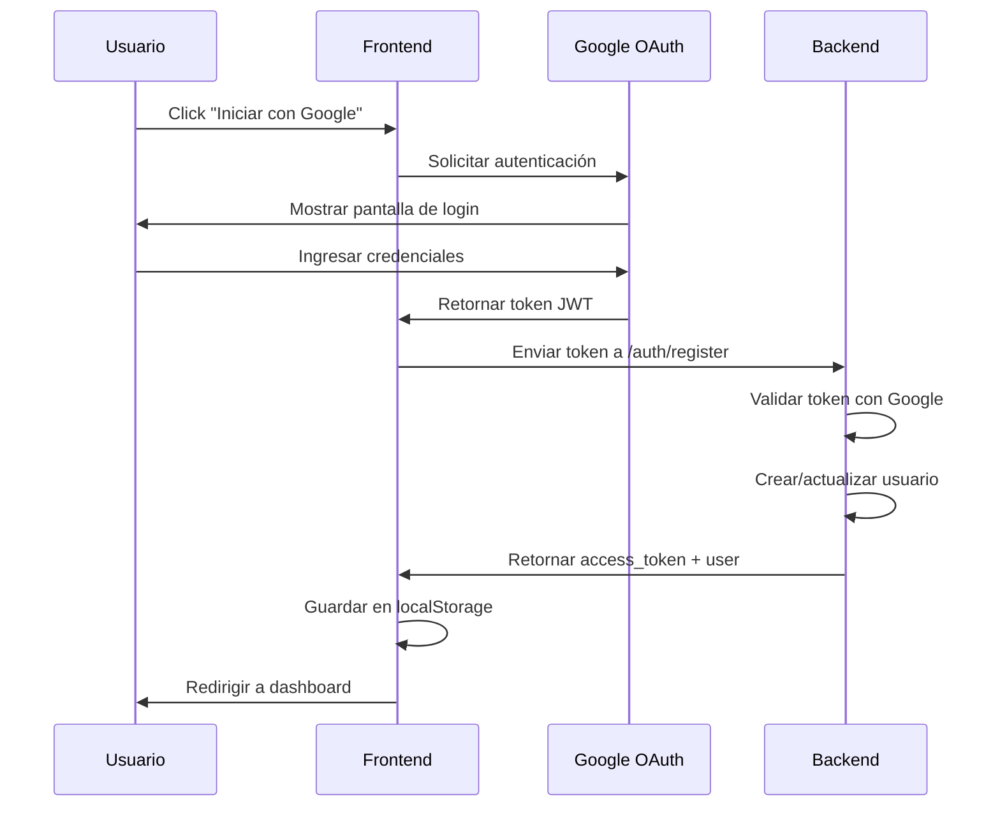
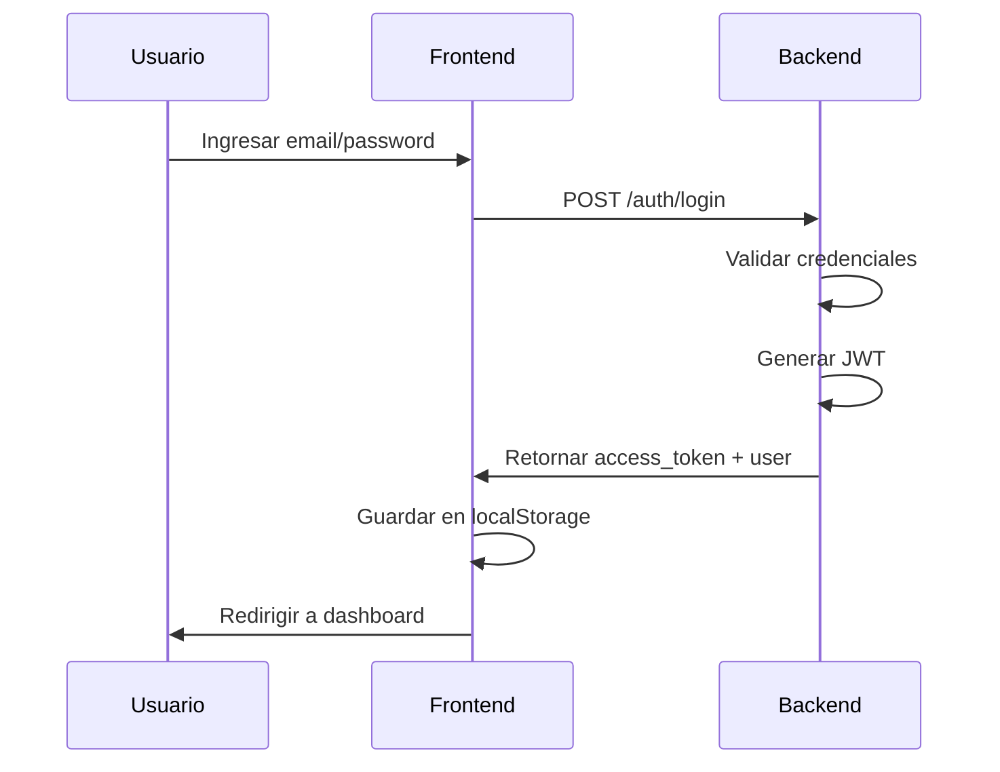

# 📰 AVISUS - Sistema de Avisos UTMA


## 📋 Descripción

**AVISUS** es una plataforma web moderna diseñada para compartir noticias y avisos relevantes de la Universidad Tecnológica de la Mixteca Alta (UTMA). El sistema permite la gestión centralizada de información institucional con autenticación segura mediante Google OAuth 2.0 y credenciales tradicionales.

## 🎯 Características Principales

- ✅ **Autenticación Multi-método**: Login con Google OAuth 2.0 y credenciales tradicionales
- 🔐 **Sistema de Roles**: Control de acceso basado en roles de usuario
- 🎨 **Interfaz Moderna**: Diseño responsive con Angular 20
- ⚡ **Server-Side Rendering (SSR)**: Renderizado del lado del servidor para mejor SEO
- 🛡️ **Seguridad Robusta**: Headers de seguridad CSP, HSTS, y protección XSS
- 🔄 **Arquitectura Reactiva**: Signals de Angular para estado reactivo
- 📱 **Progressive Web App Ready**: Optimizado para experiencia móvil

## 🏗️ Arquitectura del Sistema

### Frontend
```
┌─────────────────────────────────────┐
│         Angular 20 Frontend         │
├─────────────────────────────────────┤
│  • Zoneless Change Detection        │
│  • Server-Side Rendering (SSR)      │
│  • Reactive Signals                 │
│  • HTTP Interceptors                │
│  • Route Guards                     │
└─────────────────────────────────────┘
```

### Backend
```
┌─────────────────────────────────────┐
│         Python Backend (API)        │
├─────────────────────────────────────┤
│  • RESTful API                      │
│  • JWT Authentication               │
│  • Google OAuth Integration         │
│  • Role-based Access Control        │
└─────────────────────────────────────┘
```

## 🚀 Tecnologías Utilizadas

### Frontend
| Tecnología | Versión | Propósito |
|-----------|---------|-----------|
| Angular | 20.x | Framework principal |
| TypeScript | Latest | Lenguaje de programación |
| Express.js | Latest | Servidor Node.js para SSR |
| RxJS | Latest | Programación reactiva |
| Google OAuth 2.0 | Latest | Autenticación social |

### Backend
| Tecnología | Versión | Propósito |
|-----------|---------|-----------|
| Python | 3.x | Lenguaje backend |
| FastAPI/Flask | Latest | Framework API REST |
| JWT | Latest | Tokens de autenticación |
| SQLAlchemy | Latest | ORM Base de datos |

## 📁 Estructura del Proyecto

```
avisus_project/
│
├── src/
│   ├── app/
│   │   ├── guards/
│   │   │   └── auth.guard.ts           # Protección de rutas
│   │   ├── interceptors/
│   │   │   └── auth.interceptor.ts     # Interceptor JWT
│   │   ├── layouts/
│   │   │   └── main-layout/            # Layout principal
│   │   ├── models/
│   │   │   └── user.model.ts           # Modelos de datos
│   │   ├── services/
│   │   │   ├── auth.service.ts         # Servicio de autenticación
│   │   │   └── user.service.ts         # Servicio de usuarios
│   │   ├── shared/
│   │   │   └── components/
│   │   │       ├── cell/
│   │   │       │   ├── login.component/
│   │   │       │   └── register.component/
│   │   │       └── organice/
│   │   │           └── dashboard.component/
│   │   ├── app.config.ts               # Configuración de la app
│   │   ├── app.config.server.ts        # Configuración SSR
│   │   ├── app.routes.ts               # Definición de rutas
│   │   └── app.ts                      # Componente raíz
│   │
│   ├── environments/
│   │   └── environment.ts              # Variables de entorno
│   │
│   ├── ssr/
│   │   └── security-headers.ts         # Headers de seguridad
│   │
│   ├── index.html                      # HTML principal
│   ├── main.ts                         # Entry point cliente
│   ├── main.server.ts                  # Entry point servidor
│   └── server.ts                       # Servidor Express
│
├── angular.json                        # Configuración Angular
├── package.json                        # Dependencias Node.js
├── tsconfig.json                       # Configuración TypeScript
└── README.md                           # Este archivo
```

## ⚙️ Instalación y Configuración

### Requisitos Previos

- Node.js 18+ y npm
- Python 3.8+
- Git

### 1️⃣ Clonar el Repositorio

```bash
git clone https://github.com/utm24090599-design/avisus_project.git
cd avisus_project
```

### 2️⃣ Configurar Frontend

```bash
# Instalar dependencias
npm install

# Configurar variables de entorno
# Crear archivo src/environments/environment.ts
```

**Ejemplo de `environment.ts`:**
```typescript
export const environment = {
  production: false,
  apiUrl: 'http://localhost:8000',
  googleClientId: 'TU_GOOGLE_CLIENT_ID'
};
```

### 3️⃣ Configurar Backend

```bash
# Navegar al directorio backend
cd backend

# Crear entorno virtual
python -m venv venv
source venv/bin/activate  # En Windows: venv\Scripts\activate

# Instalar dependencias
pip install -r requirements.txt

# Configurar variables de entorno
cp .env.example .env
# Editar .env con tus credenciales
```

### 4️⃣ Configurar Google OAuth

1. Ve a [Google Cloud Console](https://console.cloud.google.com/)
2. Crea un nuevo proyecto o selecciona uno existente
3. Habilita la API de Google+ 
4. Crea credenciales OAuth 2.0
5. Agrega las URIs autorizadas:
   - `http://localhost:4200`
   - `http://localhost:4000`
6. Copia el Client ID y agrégalo a `environment.ts`

## 🎮 Uso

### Modo Desarrollo

**Terminal 1 - Backend:**
```bash
cd backend
source venv/bin/activate
uvicorn api.index:app --reload --port 8000
# API corriendo en http://localhost:8000
```

**Terminal 2 - Frontend:**
```bash
npm run dev
# Aplicación corriendo en http://localhost:4200
```

### Modo Producción

**Build:**
```bash
npm run build
```

**Servidor SSR:**
```bash
npm run serve:ssr
# Aplicación corriendo en http://localhost:4000
```

### Con PM2 (Recomendado para producción)

```bash
pm2 start dist/server/server.mjs --name avisus
pm2 save
pm2 startup
```

## 🔐 Sistema de Autenticación

### Flujo de Autenticación con Google



### Flujo de Autenticación Tradicional



## 🛡️ Seguridad

### Headers de Seguridad Implementados

```typescript
Content-Security-Policy: "default-src 'self'; script-src 'self' https://accounts.google.com"
Strict-Transport-Security: "max-age=31536000; includeSubDomains"
X-Content-Type-Options: "nosniff"
X-Frame-Options: "DENY"
X-XSS-Protection: "1; mode=block"
Referrer-Policy: "strict-origin-when-cross-origin"
```

### Protección de Rutas

- **Auth Guard**: Protege rutas que requieren autenticación
- **JWT Interceptor**: Agrega automáticamente el token a las peticiones HTTP
- **Role-based Access**: Control de acceso basado en roles

## 🧪 Testing

```bash
# Ejecutar tests unitarios
npm test

# Ejecutar tests con cobertura
npm run test:coverage

# Ejecutar tests e2e
npm run e2e
```

## 📊 Modelos de Datos

### Usuario

```typescript
interface User {
  id: number;
  email: string;
  name: string;
  picture?: string;
  role: string;
  role_color: string;
  role_badge: string;
  created_at: string;
  last_login: string;
}
```

### Respuesta de Autenticación

```typescript
interface AuthResponse {
  access_token: string;
  token_type: string;
  user: User;
}
```

## 🔄 Estado Reactivo con Signals

El proyecto utiliza Angular Signals para gestión de estado reactivo:

```typescript
// Signals privados
private currentUserSignal = signal<User | null>(null);
private tokenSignal = signal<string | null>(null);

// Computed signals públicos
readonly currentUser = computed(() => this.currentUserSignal());
readonly isAuthenticated = computed(() => !!this.tokenSignal());
```

## 📱 Progressive Web App

El proyecto está configurado para funcionar como PWA:

- Service Workers para caché offline
- Manifest para instalación
- Optimización de recursos

## 🌐 API Endpoints

### Autenticación

| Método | Endpoint | Descripción |
|--------|----------|-------------|
| POST | `/auth/register` | Registro con Google OAuth |
| POST | `/auth/register-traditional` | Registro tradicional |
| POST | `/auth/login` | Login tradicional |
| GET | `/auth/me` | Obtener usuario actual |

### Usuarios

| Método | Endpoint | Descripción |
|--------|----------|-------------|
| GET | `/api/users` | Listar todos los usuarios |
| GET | `/api/users/role/{role}` | Usuarios por rol |
| GET | `/api/user/{id}` | Usuario por ID |

## 🤝 Contribución

1. Fork el proyecto
2. Crea una rama para tu feature (`git checkout -b feature/AmazingFeature`)
3. Commit tus cambios (`git commit -m 'Add: AmazingFeature'`)
4. Push a la rama (`git push origin feature/AmazingFeature`)
5. Abre un Pull Request

## 📝 Convenciones de Código

- **Commits**: Seguir [Conventional Commits](https://www.conventionalcommits.org/)
- **TypeScript**: Strict mode habilitado
- **Angular**: Seguir la guía de estilos oficial
- **Python**: Seguir PEP 8

## 🐛 Reportar Problemas

Si encuentras algún bug o tienes alguna sugerencia, por favor abre un [issue](https://github.com/utm24090599-design/avisus_project/issues).

## 📄 Licencia

Este proyecto está bajo la Licencia MIT. Ver el archivo `LICENSE` para más detalles.
